## Scikit-Learn Case Study

### Project Description

[Scikit-learn](https://scikit-learn.org/stable/index.html) is a free open source machine learning library for the Python Programming Language. As a library, it provides popular classes of statistical learning related algorithms such as regression, clustering and support vector machines. The following figure presents an overview of the Scikit-learn library:

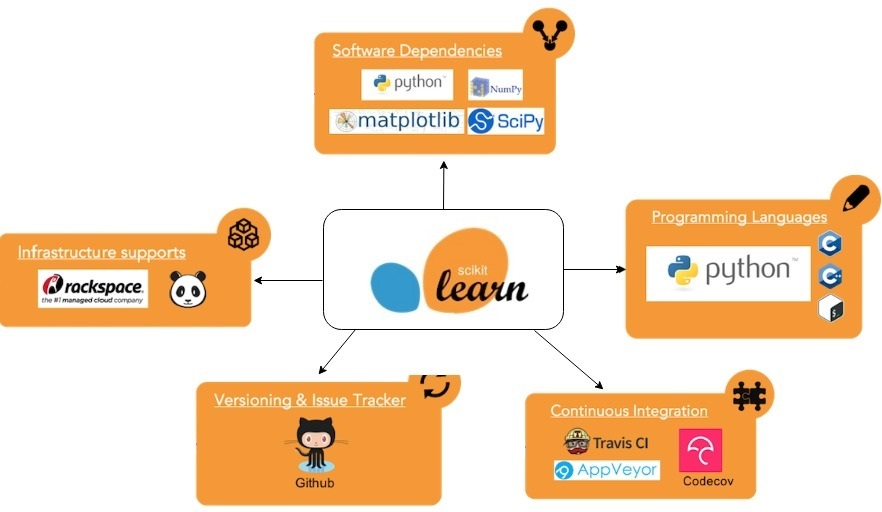

Scikit-learn frequently ranks very high against other machine learning libraries ([example ranking 1](https://www.kdnuggets.com/2018/10/top-python-machine-learning-libraries.html), [example ranking 2](https://activewizards.com/blog/top-20-python-libraries-for-data-science-in-2018/)) not only due to GitHub activity but also due its inherit advantages it provides as a platform:

- __Free Platform__:
Because scikit-learn is released with a BSD license, it can be used for free by everyone. This license has minimal restrictions; therefore, users can utilize it to design their applications and platforms with little worry over limitations.

- __Industrial Use__: 
Scikit-learn is a helpful platform that can predict consumer behavior, identify abusive actions in the cloud, create neuroimages, and more. It is being used extensively by commercial and research organizations around the world, a testament to its ease of use and overall advantage.

- __Collaborative Library__:
Scikit-learn began as a one-man mission but now it is being built by numerous authors from INRIA spearheaded by Fabian Pedregosa and individual contributors who are not attached to teams or organizations. This makes the module a well-updated one, releasing updates several times a year. Users can also look forward to assistance from an international community, in case they have queries or if they hit snags in development using the module.

- __Ease of Use__:
Commercial entities and research organizations alike have employed scikit-learn in their processes. They all agree that the module is easy-to-use, thereby allowing them to perform a multitude of processes with nary a problem.

- __API Documentation__:
Scikit-learn ensures that users old and new alike get the assistance they need in integrating the machine learning module into their own platforms. That is why a documentation detailing the use of its API exists that users can access anytime on the website. This makes certain developers can implement machine learning algorithms offered by the tool seamlessly.

- __Technology & Platform used for development__:
Scikit-learn is built in Python. The latest version of scikit requires Python 3.5 or above. The choice of Python is appropriate due to its rich math and scientific libraries like Numpy, Scipy and matplotlib. Scikit uses Numpy 1.11.0 or above and Scipy 0.17.0 or above. 

### Programming Language Usage

Scikit-learn is developed using three core languages.
- Python: Core language of the Scikit-learn
- C/C++: Source code in this language is primarily found in `scikit-learn/utils` and describes extensions to be compiled at setup time. Some algorithms such as support vector machines
- Cython: A superset of python allowing for a more "pythonic" means of utilizing and writing extensions written in C/C++

From investigating the languages used within this project, I believe there is a high chance they would be used in the future. Python has recently surpassed R as the most popular language for problems with the Data Science domain despite R's specialization. This is of no surprise because as a general purpose language, more developers/scientist will be familiar with the Python ecosystem hence bolstering its popularity ([source](https://www.datasciencecentral.com/profiles/blogs/python-overtakes-r-for-data-science-and-machine-learning)). It is possible, however, that extensions could be written in another "systems-level language" such as Rust. While the Rust runtime has garbage collection, it more lightweight than Python's interpreter. 

### Technology/Library Usage

Scikit-learn is a Python 3.5 based project which utilizes four core libraries to perform much of the statistical analysis and training of the statistical model: 

1. __Numpy__: Provides utilities for accessing and manipulating n-dimensional arrays
2. __SciPy__: Premier scientific computing library for python
3. __OpenMP__: OpenMP or Open Multi-Processing exposes an API for parallelism which is used by Scikit-learn extensions written in C/C++
4. __Cython__: Library providing native python support for C extensions; given the scale as to which datasets and feature vector dimensionality can grow, Scikit-learn implements core algorithms in C/C++ take advantage of the lightweight C runtime
5. __Matplotlib__: A native 2D plotting library for the Python Programming Language used to visualize algorithms applied to datasets

### Functional Decomposition

Conceptually Scikit-learn is a composition of six major functional components:

- __Classification__: Trains a statistical model using provided samples of features belonging to a particular class. The statistical model provides as output the predicted class label of a given dataset. 
- __Clustering__:  Identify the intrinsic grouping which is formed from a given dataset. Samples are grouped based on a similarity criterion defined by the clustering method. Scikit-learn offers a large amount clustering methods such as K-Means, DBSCAN and Spectral Clustering 
- __Regression__: In cases where the model can be described as a linear function or a linear combination features within the dataset, a regression can be utilized to generate a linear model. Some example methods provided through Scikit-learn are Ordinary Least Squares, Lasso and Ridge Regression
- __Preprocessing__: Prior to training the statistical model, it may be necessary to perform some preliminary computation on the training dataset, specifically feature vectors. Majority of the operations provided by the preprocessing module involve normalization or standardization of the dataset prior to consumption by the estimators
- __Dimensionality Reduction__: PCA (Principle Component Analysis) implementation is provided as a means to reduce the effective number of features within the model through dimensional projection. 
- __Model Selection__: To ensure the predictive capability of the model, we generally want to avoid overfitting. Scikit-learn provides several Cross-Validation strategies which help with the selection and partitioning of data

The high-level diagram below provides a visual representation of the functional decomposition and example use cases for each component.

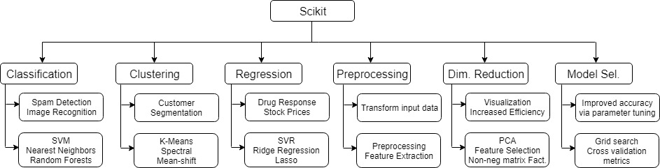

### Library Design

Although Scikit-learn is a unique machine learning library implementation, it closely follows the general design paradigm which mostly all projects share. As illustrated in the figure below, the application takes as input training data in the form of samples pertaining to specific "features". With a feature vector created, various transformations such as extractions and reductions can be performed before estimating a predictive model. 

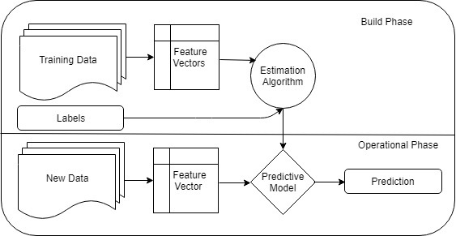

Through investigating the design choices of the codebase there seems to be a strong emphasis placed the object-oriented paradigm. Specifically, the codebase makes have heavy usage of class inheritance to define instances of specialized versions of core classes such as Transformers, Classifiers
, Regressors. Within `**/base.py` files such as `scikit-learn/sklearn/base.py`, it is interesting to note the `*MIXIN` classes which can be seen used quite frequently throughout the codebase. A Canonical use case for MIXIN classes is to avoid the complications that arise with multiple inheritances, such as the infamous diamond problem while injecting methods into other classes. The end result is code reuse without establishing superfluous relations among classes. However, within the Scikit-learn codebase, MIXINs are ironically implemented through multiple inheritances.

A sizeable portion of the codebase contains standalone functions serving as utility or helpers for classes or other defined functions. It is also common to see algorithms implemented as standalone functions and shared among classes within the same module. For example in `scikit-learn/sklearn/covariance/graph_lasso_.py`, we can see the function `graphical_lasso(....)` defined which is used by the class `GraphicalLasso` and the function `graphical_lasso_path(...)`. In a sense, these functions act as `static` methods or in a more "pythonic" view, they are scoped to the module itself, not any particular user-defined class.

With some familiarity of the design choices, it will be rather straightforward to extend the functionality of Scikit-learn. For example, to quickly improve the mean accuracy calculation for all `Classifiers` within the Scikit-learn project, we can simply edit the implementation found within the `ClassifierMixin` class. Furthermore, because Scikit-learn is meant to act as a standalone library, even are involved extension such as adding a new algorithm is not too arduous; it will mostly involve defining the necessary MIXINs and base classes along with needed unit tests. The directory structure will mimic the current scheme to maintain consistency with the rest of the codebase.

### Build System
 
Building Scikit-learn from source requires a few dependencies
- `python >= 3.5`
- `numpy >= 1.11` 
- `scipy >= 0.17`
- `cython >= 0.28.5`
- `OpenMP (no version requirement specified)`

Having installed these dependencies, one can build the project using `python setup.py install`. As mentioned earlier, a good portion of the codebase consists of Cython, the superset of Python. Each Cython file (`*.pyx`) must be compiled to a C source file. C source files are then compiled into shared objects (`*.so`) which can be imported as modules through various helper libraries in Python such as setuptools and distutils. Note that Scikit-learn has a `Makefile` located in the project root directory; executing `make` will build the project "in place" (an alias for `python setup.py build_ext -i`) in addition to launching pytest.

### Testing

Scikit-learn utilizes PyTest (version 3.3.0 or above) as the main testing framework for the project. Tests located within the directory `sklearn/tests` cover the core functionality used throughout the program.
Launching the test simply requires the command `pytest sklearn`. The figure below shows an example result in running PyTest on the defined tests.

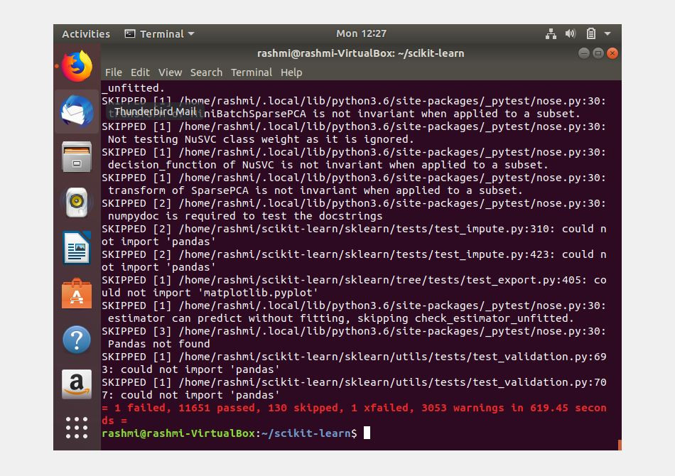

As depicted in the screenshot below, the test failure is caused by running out of available memory on the host system. This is not a surprising result because I am running Scikit-learn on a virtual machine which shares only `1024 MB` of memory (in which nearly half is used by the Linux Kernel Image). Therefore, this failing test used a much larger number of features than C's `malloc()` was willing support. A major reason of pointing out this particular testing session is to argue that this is an area in which Scikit-learn can improve; when testing, especially unit testing, it is generally preferable to limit the amount of non-deterministic behavior within the test cases. In this case, I would modify the test so that the number of features used is bounded by the available memory. An even better alternative is to avoid dynamically allocating memory since this functionality is independent of the core Scikit-learn implementation.

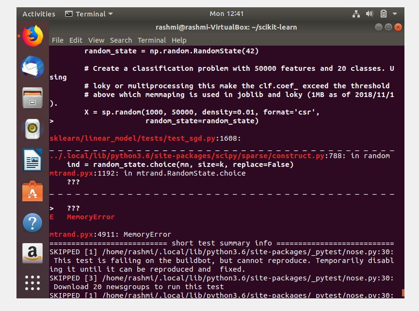

#### Code Coverage

Code coverage gives an analytical idea on how well the code or an application has been tested. Tests might return positive results across the board, but if they cover only 30-40% of the code, it’s really hard to gain confidence about the application. Hence, the higher the value of code coverage, the better is the end product. Higher code coverage value indicates a more thorough testing of the application and fewer show-stopper bugs. Scikit-learn team integrates [Codecov](https://docs.codecov.io/docs) with their Github repository which provides both textual and visual representations of how well tests cover the code base. 

The diagram below provides a snippet of code coverage from the perspective of the directory hierarchy. Through this interface, it is possible to traverse deeper with the source tree to adjust the granularity of the code coverage breakdown.

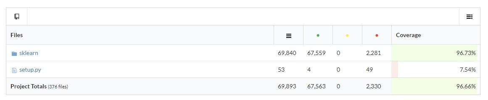

The code coverage chart, shown below, provides a view of how code coverage changes throughout the history of the project.

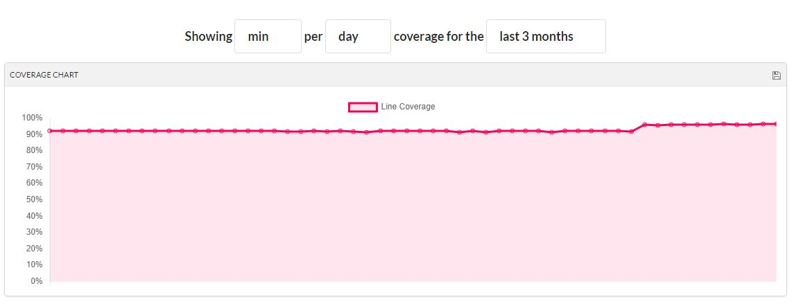

The sunburst diagram provides an alternative representation of code coverage breakdown. Users interact with the diagram to quickly zero-in on project paths which might be lacking coverage. This view is far more convenient than the typical directory view for non-trivial projects with deeply nested directory structures. 

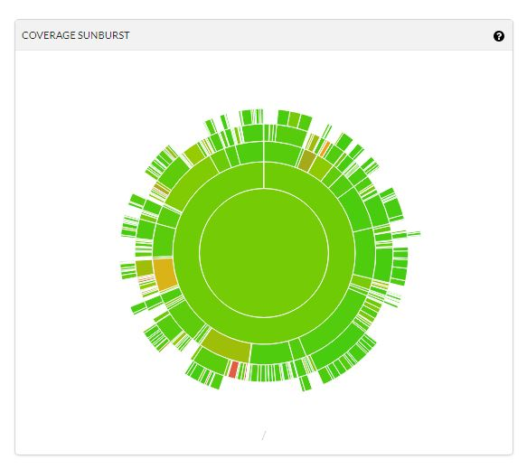

### Continuous Integration 

Scikit-learn utilizes both TravisCI and CircleCI for continuous integration. TravisCI configuration is found within `.travis.yml`. For CircleCI, we can find the configuration file is located in `.circleci/config.yml`. In both configurations, tests triggered by pushes to the remote run within a Linux virtual machine instance. Screenshots below show some of the activity of on both platforms. 

#### Circle CI
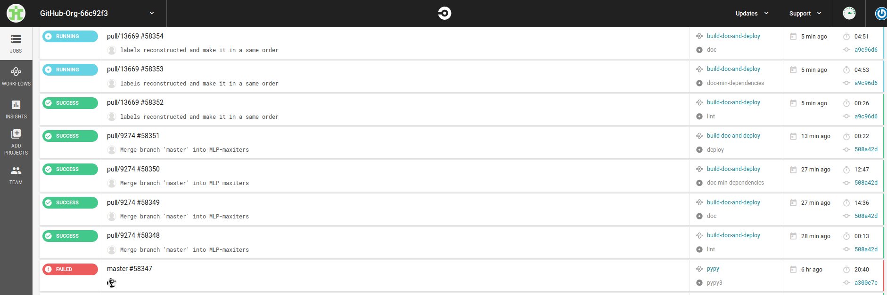

#### Travis CI
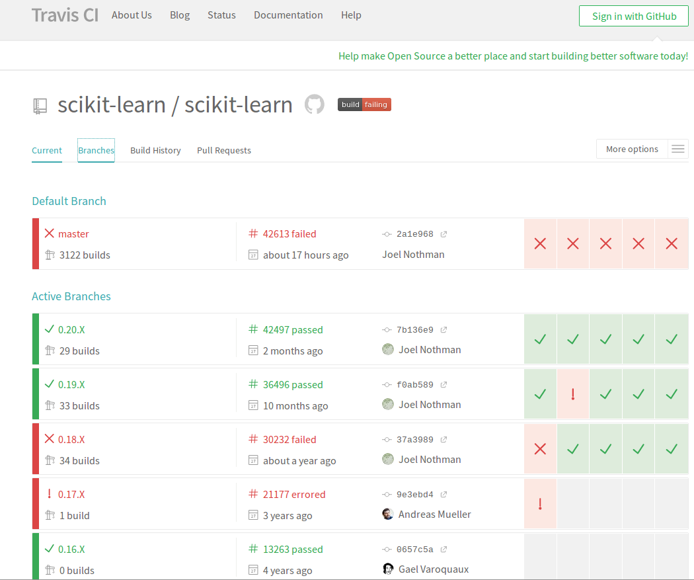

A natural question that arose during the writing of this case study is why use two continuous integration platforms simultaneously? My current speculation is that redundancy is desired; if one service happens to fail right before a scheduled release build integration, a backup is available. 

### Defects

Scikit-learn recommends opening an issue in the issue tracker. This enables contributors to get some feedback from core developers. 
Advantage of this approach is that it avoids work duplication and avoids adding non-trivial features to the existing system. 
They also suggest going through the issue list or the pull request list before opening an issue. 
Most of the issues in Scikit are related to feature update or adding new functionality. I couldn’t spot an issue which requires an architecture change. There are about 1,249 issues opened on GitHub. Two of the bugs that I would like to discuss are:

1. [silhouette_samples gives incorrect result from precomputed distance matrix with diagonal entries #12178](https://github.com/scikit-learn/scikit-learn/issues/12178):
The problem reported here is that whenever the input distance matrix has non-zero values along the diagonal then the silhouette scores are incorrect. And the suggested solution for this problem is that the diagonal entries of the precomputed distance matrix should be set to zero before calculating the silhouette score. The way I would tackle this issue is: 
    - Before computing the silhouette score I would check if the diagonal entries in the distance matrix are zero, if not, raise an exception. 
    - Compute the silhouette score based on non-zero diagonal values and generate a warning message indicating that the values have been computed using non-zero values and the user must check the computations before proceeding. The reason for going for this second type of fix can be attributed to the fact that the documentation does not clearly mention the requirement of having non-zero values for the diagonal entries in a distance matrix.
2. [Saving KernelDensity with sample_weight #13692](https://github.com/scikit-learn/scikit-learn/issues/13692):
A TypeError is reported when saving to file kernel density estimation with sample weight. Apparently, the variable name used to store the data is used incorrectly. Fixing the variable name from sample_weight to sample_weight_arr will fix the bug. Moreover, there should be valid exception handling done around the code to catch these types of errors.

### Demo

Example usage of the algorithms provided through Scikit-learn can be found within `scikit-learn/examples` which allows for a quick demonstration of the library. 

#### Number Classification through Images

The figure below shows the accuracy of a Support Vector Classifier (SVM) in detecting handwritten digits.
This example can be launched by executing `python scikit-learn/examples/examples/classification/plot_digits_classification.py`

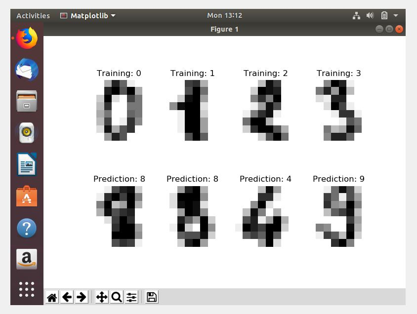

#### K-means Clustering

The figure below represents a plot of KMeans clustering using silhouette analysis. Silhouette analysis is useful in studying the relative distance between generated clusters. In this example 
*n* = 6 which represents the maximum number of clusters to generate. This example can be launched by executing `python scikit-learn/examples/examples/cluster/plot_kmeans_silhouette_analysis.py`

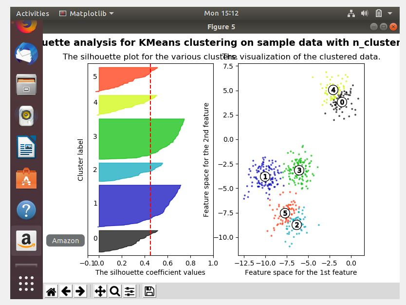

### Public Reviews

#### Pros

- Scikit-learn has a good selection of algorithms It’s a fairly conservative project that’s pretty careful about avoiding scope creep and jumping on unproven algorithms, for reasons of maintainability and limited developer resources. 
- The modules are well-updated one, releasing updates several times a year. Users can also look forward to assistance from an international community, in case they have queries or if they hit snags in development using the module. 
- A documentation detailing the use of its API exists that users can access anytime on the website. This makes certain developers can implement machine learning algorithms offered by the tool seamlessly.

#### Cons

- Scikit-learn doesn’t support GPU acceleration for multiple reasons having to do with the complexity and the machine dependencies it would introduce. Then again, aside from neural networks, Scikit-learn has little need for GPU acceleration. 
- Scikit-learn’s implementation of MLP is expressly not intended for large-scale applications Scikit-learn does not cover are deep learning, reinforcement learning, graphical models, and sequence prediction. 
- It is defined as being in and for Python, so it doesn’t have APIs for other languages. 

